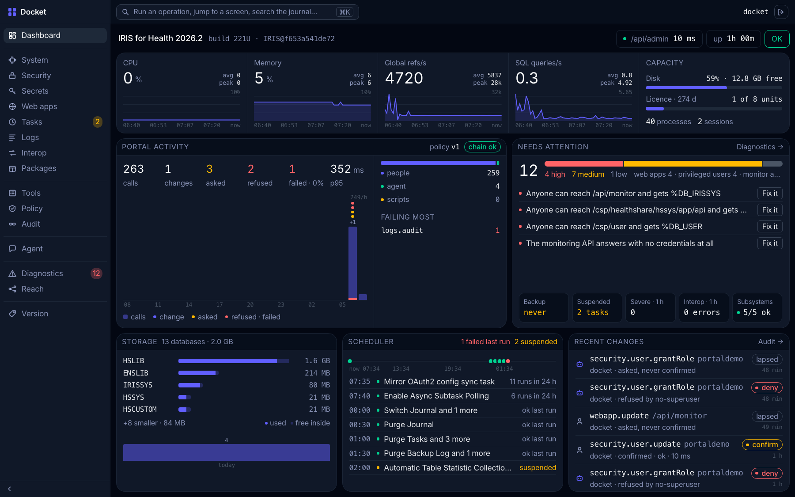
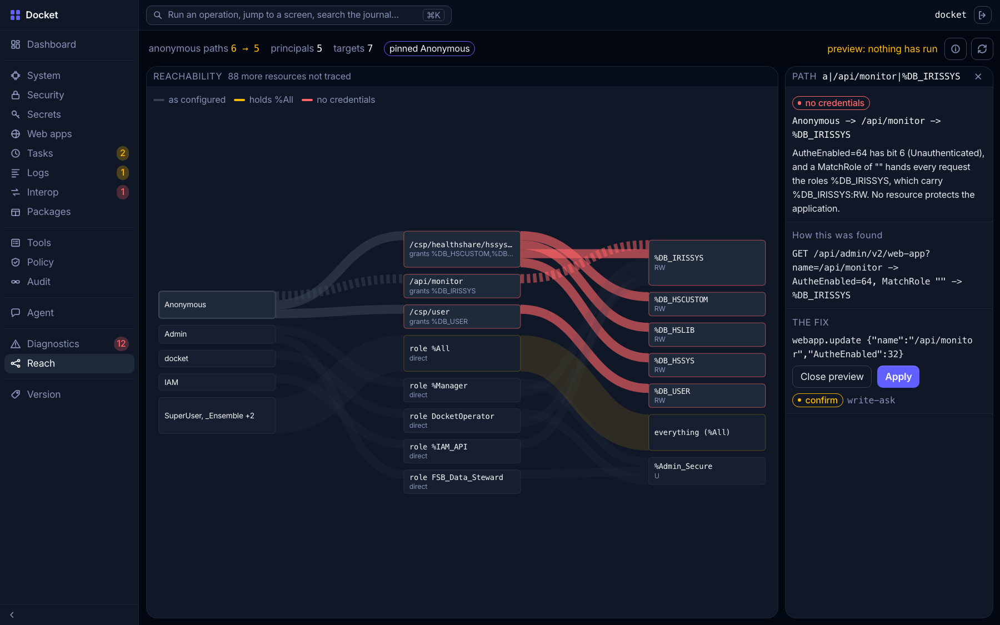
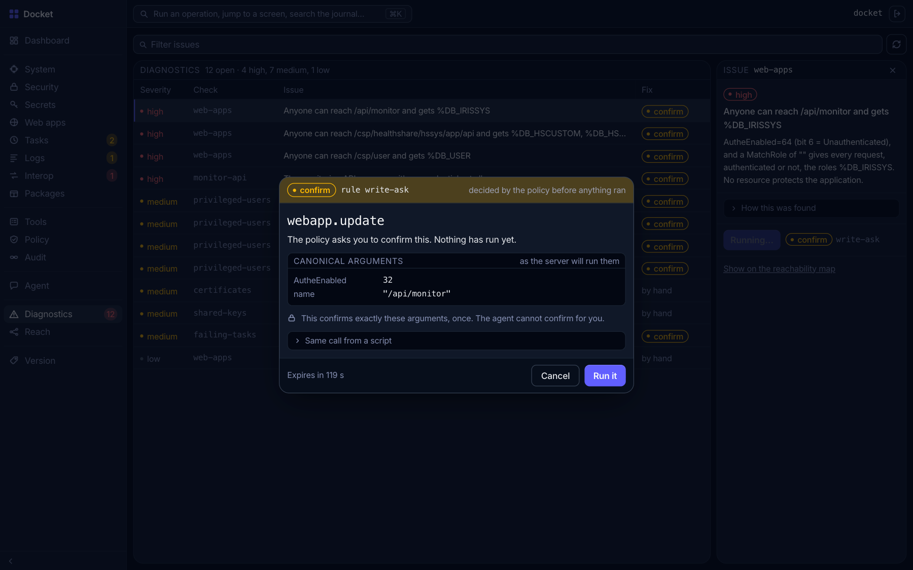
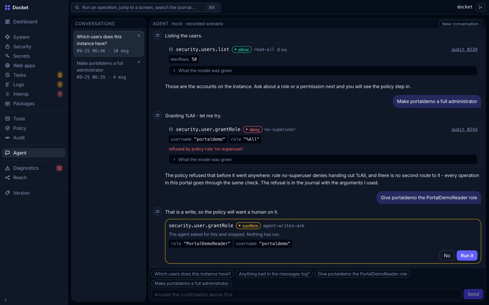
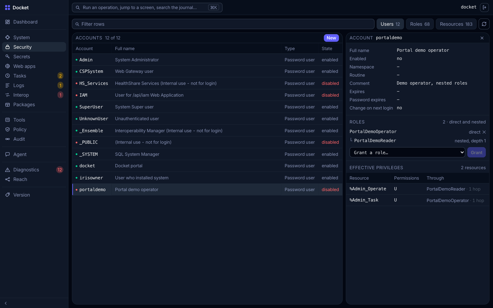
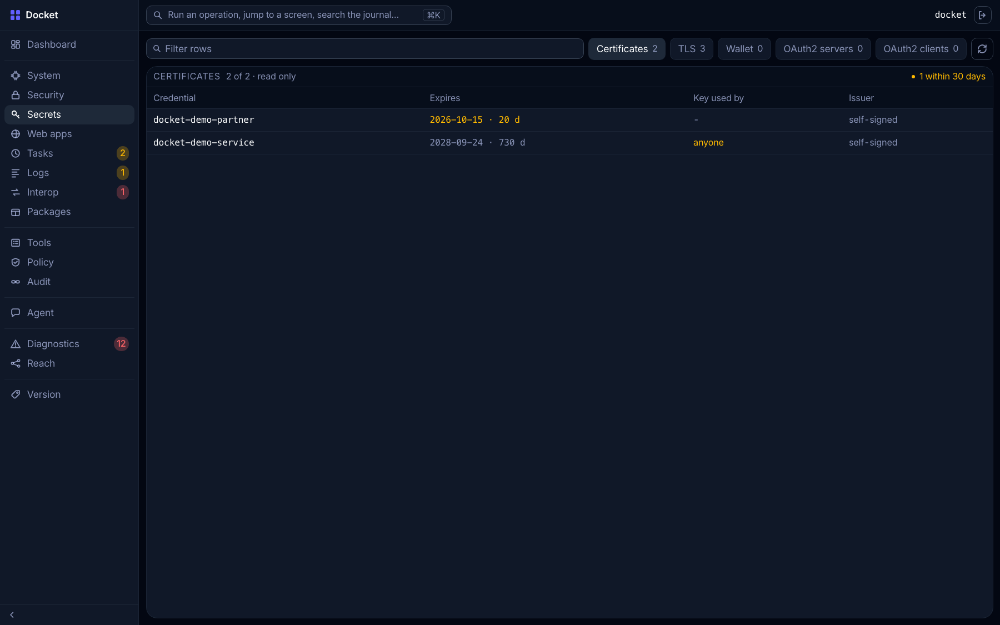
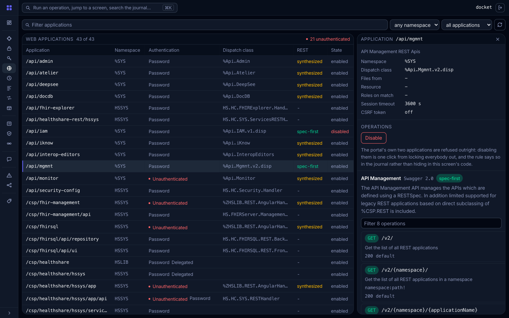
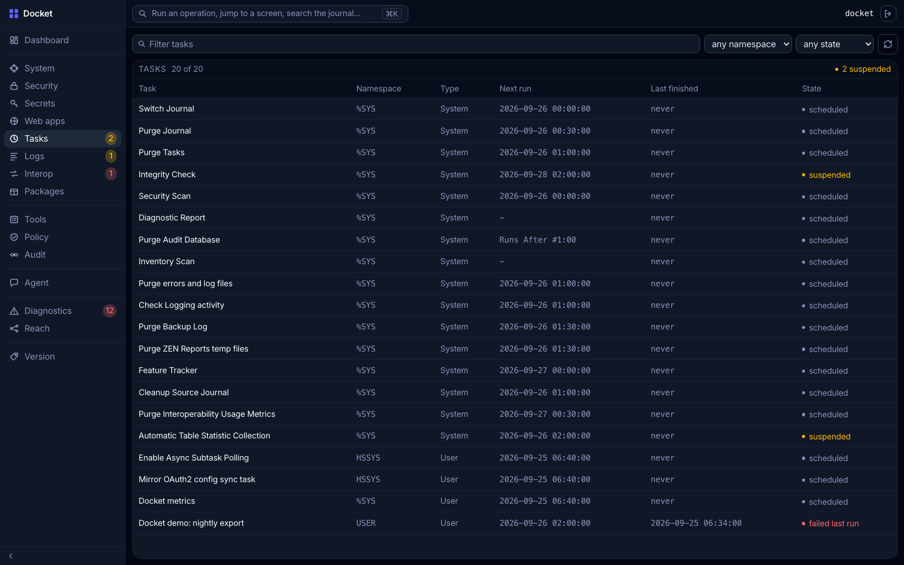
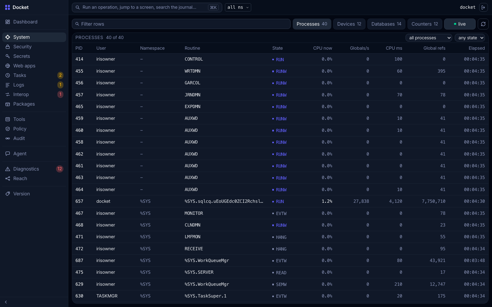
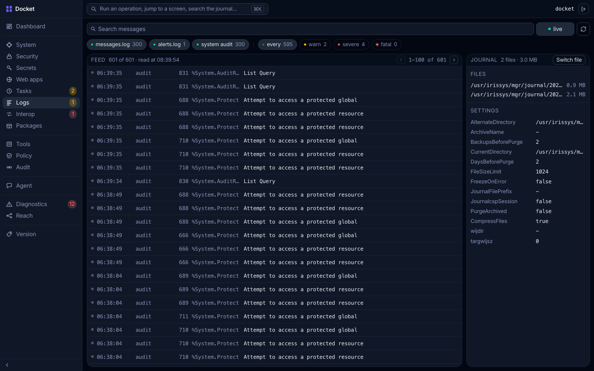

# Docket

Management portal for InterSystems IRIS. Every operation, from a screen, the agent or a script,
goes through one policy and lands in one hash-chained journal.

[](https://community.objectscriptquality.com/dashboard?id=intersystems_iris_community%2Fis-docket)
[](https://github.com/AntonYartsev/is-docket/actions/workflows/install-paths.yml)
[](LICENSE)



## Quick start

```bash
docker compose up --build
```

Open <http://localhost:52773/portal/index.html>, login `docket` / `12345`.
- port busy? `IRIS_PORT=52780 docker compose up --build`
- first build is slow, give Docker 4 GB+
- agent plays a recorded scenario by default (`LLM_MODE=mock`). For a real model set `LLM_MODE=live`
  and `OPENROUTER_API_KEY` in `.env`

## 90-second tour

1. **Dashboard**. Stock image, nobody touched it, and it already shows **12 findings, 4 high**: web
   apps giving anonymous callers a database role, `/api/monitor` open without credentials
2. **Reach**. Click **Anonymous**, then the red ribbon `/api/monitor → %DB_IRISSYS`, then
   **Preview fix**. Counter goes `6 → 5`, policy says `confirm`. Nothing ran yet

   

3. **Diagnostics**, first row, **Fix it**. Dialog shows the exact arguments and the rule, journal
   already has a `pending` row. **Run it**, findings drop to 10

   

4. **Audit**. `Chain intact`. **Chain** downloads the export, `verify.html` rehashes it in the
   browser without a single request
5. **Agent**. Send *Make portaldemo a full administrator*. Model asks for `grantRole` with `%All`,
   rule `no-superuser` refuses. Ask for `PortalDemoReader` and the turn waits for your confirm

   

Only step 3 changes the instance. Reset:
`docker compose down -v && docker compose build --no-cache && docker compose up`

## Whats different

- **Journal you can check yourself.** Every call, refusals too, is written before it runs and
  hash-chained. `verify.html` checks an export offline
- **Policy is data.** 13 JSON rules, first match wins, default `deny`. Editing it is a tool as
  well: validated, confirmed, journalled
- **Agent cant go around the rules.** Same registry minus what policy denies it, confirm token goes
  to the browser, never to the model
- **Reach.** Who gets to which resource and by which path, with a fix preview before anything runs
- **Diagnostics.** 12 checks, each shows the request it made. Fixes go through the policy
- **No `%All`.** You login as `docket` with one role, every resource in it measured
- **Beyond `/api/admin`.** Interop (productions, messages, errors from `Ens`) and Packages (IPM
  against the community registry)

## Screens

**Security.** Users, roles, resources and what `/api/admin` wont tell you: effective privileges,
each with the role it comes from. System roles (`%All`, `%Manager`, `%DB_*`) are refused by policy



**Secrets.** X.509 with expiry and who can use the key, TLS, wallets, OAuth2. Read only, secret
values never returned



**Web apps.** Auth per app (21 of 43 take anonymous), REST services and their specs from
`/api/mgmnt`. Safe methods can be tried right there



**Tasks.** Run, suspend, resume. `GET /v2/tasks` always says `"Suspended": false`, so the flag
comes from `%SYS.Task`



**System.** Processes, devices, databases. The process serving the request cant be killed



**Logs.** `messages.log`, `alerts.log` and the system audit in one feed. Files are read from disk,
`/api/admin` cant do that



## Install into an existing instance

From `%SYS`:

```
zpm "install docket"
```

Creates `/portal` and `/portal/api`, role `DocketOperator`, the metrics task, installs `jsonschema`
if missing. No accounts, no demo data: login with your own account holding `DocketOperator`. Set
`IRIS_ADMIN_USER` / `IRIS_ADMIN_PASSWORD` in the instance env before IRIS starts. Tests:
`zpm "docket test"`

## From a script

Same policy, same journal.

```bash
U='docket:12345'; P=localhost:52773/portal/api

# all tools, also as OpenAPI 3.1
curl -su "$U" $P/tools
curl -su "$U" $P/openapi.json

# read: allowed, journalled
curl -su "$U" $P/tools/security.users.list/invoke -H 'Content-Type: application/json' \
  -d '{"args":{"maxRows":50}}'

# write: 409 + error.detail.confirmToken (120 s), nothing ran
curl -su "$U" $P/tools/security.user.update/invoke -H 'Content-Type: application/json' \
  -d '{"args":{"name":"portaldemo","Comment":"set from a script"}}'

# same args + token: 200, once
curl -su "$U" $P/tools/security.user.update/invoke -H 'Content-Type: application/json' \
  -d '{"args":{"name":"portaldemo","Comment":"set from a script"},"confirmToken":"<token>"}'

# refused: 403, rule no-superuser
curl -su "$U" $P/tools/security.user.grantRole/invoke -H 'Content-Type: application/json' \
  -d '{"args":{"username":"portaldemo","role":"%All"}}'

# journal, chain check, export for verify.html
curl -su "$U" $P/audit
curl -su "$U" $P/audit/verify
curl -su "$U" $P/audit/export -o docket-audit-chain.json
```

## Privileges

`docket` has one role, `DocketOperator`, no `%All`, and the code never raises its own privileges.

| Resource | For |
|---|---|
| `%DB_IRISSYS:RW` | everything: the journal row is written first, so no access = no call |
| `%Admin_Secure:U` | users, roles, web apps, TLS, X.509, audit |
| `%Admin_Operate:U` | processes, metrics, journal, logs |
| `%Admin_Manage:U` | devices, databases, journal settings |
| `%Admin_Task:U` | task run / suspend / resume |
| `%Admin_Wallet:U`, `%Admin_OAuth2_Client:U` | wallets, OAuth2 |
| `%DB_USER:R` | Interop |
| `%Ens_ProductionRun:U` | production start / stop |

Plus `SELECT` on `%SYS.Task`, `App_Audit.Entry`, `Ens.MessageHeader`, `Ens_Util.Log`, granted at
setup. Installing a package needs `%All`, IPM doesnt work with less.

`IRIS_ADMIN_USER` / `IRIS_ADMIN_PASSWORD` in `.env` is the account for `/api/admin`, it never
reaches the browser. Created only if missing, grant it `DocketOperator`.

## Limitations

- Basic auth only. Browser holds no credentials, just the session cookie
- no create / delete for web apps and tasks
- secrets are read only, by design
- Interop: read, start, stop. No resend, no config
- live agent: OpenRouter models with tool calling, tested on `google/gemini-2.5-flash`
- verified on arm64 only
- dark desktop layout

## Tests and CI

```bash
docker exec -i docket iris session IRIS -U%SYS "##class(App.UnitTest.Runner).All()"
```

11 classes, 56 methods: policy, confirm tokens, chain tampering, the export rehashed in Python,
`/api/admin` error shapes, and a grep that nothing but `App.Tools.Invoker` calls `Execute()`.

CI: `install-paths` (docker + zpm on a clean instance), `spec-registry` (SHA pin, generated classes
up to date), ObjectScript Quality.

## Prior art

- `sysadmin-api-specification`: vendored in `spec/`, source of the generated tools
- `iris-fullstack-template`: structure and build
- `WebTerminal`: not taken, a terminal runs code outside the policy
- `iris-web-swagger-ui`, `iris-history-monitor`: looked at, not used
- `iris-governed-fhir-agent`: my earlier project, ideas only

## Author

Anton Yartsev: [InterSystems Developer Community](https://community.intersystems.com/user/anton-yartsev),
[GitHub](https://github.com/AntonYartsev).

## License

MIT, see [LICENSE](LICENSE)
